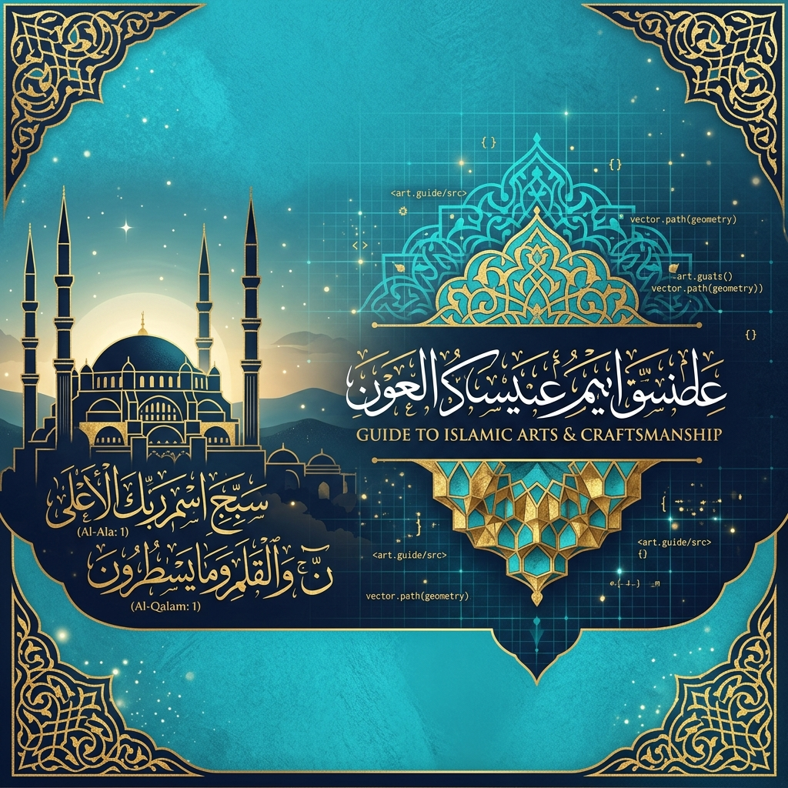
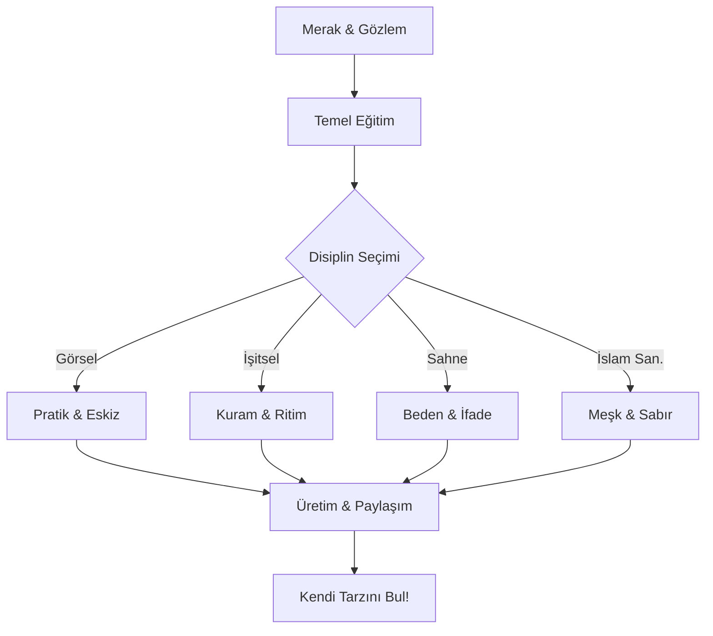

# 🎨 Sanatın İzinde: Açık Kaynak Sanat Rehberi ve Kaynakçası

  

> *"Sanat, ebediyetin dilidir; kelimelerin bittiği yerde başlayan sessiz bir haykırıştır."*

Hoş geldiniz! Bu repo, sadece bir bilgi deposu değil; sanatın manevi, toplumsal ve bireysel dönüştürücü gücünü keşfetmek isteyenler için bir **pusuladır**. Sanatın edeple birleştiği, estetiğin hikmetle harmanlandığı bu yolculukta bilginin ve güzelliğin paylaşıldıkça çoğalacağına inanıyoruz.

---

## 📂 İçindekiler
1. [📊 Vizyon ve Misyon](#-vizyon-ve-misyon)
2. [🗺️ Sanat Serüveninizi Seçin!](#️-sanat-serüveninizi-seçin)
3. [🖼️ Sanal Galeri: Başyapıtlar](#️-sanal-galeri-başyapıtlar)
4. [🌙 İslam Sanatları ve Estetiği](#-islam-sanatları-ve-estetiği)
5. [🎭 Sanatın Temel Disiplinleri](#-sanatın-temel-disiplinleri)
6. [🗺️ Gelişim İçin Yol Haritası](#-gelişim-için-yol-haritası)
7. [🚀 Sanatın Geleceği ve Dijital Dönüşüm](#-sanatın-geleceği-ve-dijital-dönüşüm)
8. [📚 Önerilen Kaynaklar](#-önerilen-kaynaklar)

---

## 📊 Vizyon ve Misyon

### Vizyonumuz
Dünya üzerindeki her bireyin, sanatın dallarından en az biriyle barışık olduğu, estetik kaygının günlük yaşamın bir parçası haline geldiği ve yaratıcılığın önündeki bariyerlerin kalktığı bir gelecek hayal ediyoruz.

### Misyonumuz
Sanatı popüler kültürün sığlığından kurtarıp; kadim kökenleri, manevi derinliği ve teknik mükemmelliği ile yeniden hak ettiği yere taşımak.

---

## 🧭 Sanat Serüveninizi Seçin!

Nereden başlayacağınızı bilmiyorsanız, size özel hazırladığımız **[Sanat Serüveni](seruven.md)** sayfamızda kendi rotanızı belirleyebilirsiniz.

---

## 🌙 İslam Sanatları ve Estetiği

Maneviyatın maddeyle buluştuğu, tevhid inancının estetik bir forma dönüştüğü dünyayı keşfedin:

*   📖 [**İslam Estetiği Rehberi**](rehberler/islam-estetigi.md): Mana ve madde arasındaki köprü.
*   🕌 [**İslam Sanatları**](disiplinler/05-islam-sanatlari.md): Hüsn-i Hat, Tezhip, Ebru ve Mimari.
*   🏛️ [**Mimari Miras Durakları**](kaynaklar/islam-sanati-mekanlar.md): Dünyadan örnekler.

---

## 🖼️ Sanal Galeri: Başyapıtlar

Dünyayı değiştiren, bakış açımızı dönüştüren büyük eserlerin hikayesini ve sanatsal analizini [**Sanal Galeri: Başyapıtlar**](galeri/bas-yapitalar.md) sayfamızda keşfedin.

---

## 🎭 Sanatın Temel Disiplinleri

*   🖼️ [**Görsel Sanatlar**](disiplinler/01-gorsel-sanatlar.md): Çizgi, renk ve form.
*   🎵 [**İşitsel Sanatlar**](disiplinler/02-isitsel-sanatlar.md): Ses ve ritim.
*   🎭 [**Sahne Sanatları**](disiplinler/03-sahne-sanatlari.md): Canlı performans ve ifade.
*   📚 [**Edebi Sanatlar**](disiplinler/04-edebi-sanatlar.md): Kelimelerle inşa.

---

## 🗺️ Gelişim İçin Yol Haritası

Ayrıntılı rehber için [**Sanata Başlangıç Rehberi**](rehberler/sanata-baslangic.md) sayfamızı ziyaret edin.

---

## 🚀 Sanatın Geleceği ve Dijital Dönüşüm

21. yüzyıl teknolojilerinin sanata etkisi: AI, NFT ve VR deneyimleri.

---

## 📚 Önerilen Kaynaklar

*   📖 [**Kitap Önerileri**](kaynaklar/kitaplar.md): Temel yapı taşları.
*   🌐 [**Dijital Platformlar**](kaynaklar/online-platformlar.md): Online sergiler.
*   🏛️ [**Müzeler ve Galeriler**](kaynaklar/muzeler.md): Görülmesi gereken duraklar.
*   🖋️ [**Özlü Sözler**](kaynaklar/ozlu-sozler.md): Ustaların ruhundan.
*   📖 [**Sanat Sözlüğü**](kaynaklar/sozluk.md): Temel kavramlar.

---

## 🌍 Neden Sanat?
Sanat, bir süsleme aracı değil, bir **varoluş mücadelesidir**. İnsanlık hafızasıdır.

---

## 🤝 Nasıl Katkıda Bulunabilirsiniz?

Lütfen [**KATKI REHBERİ**](CONTRIBUTING.md) dosyasını inceleyin.

---

**Lisans:** Bu proje [MIT Lisansı](LICENSE) kapsamında korunmaktadır.