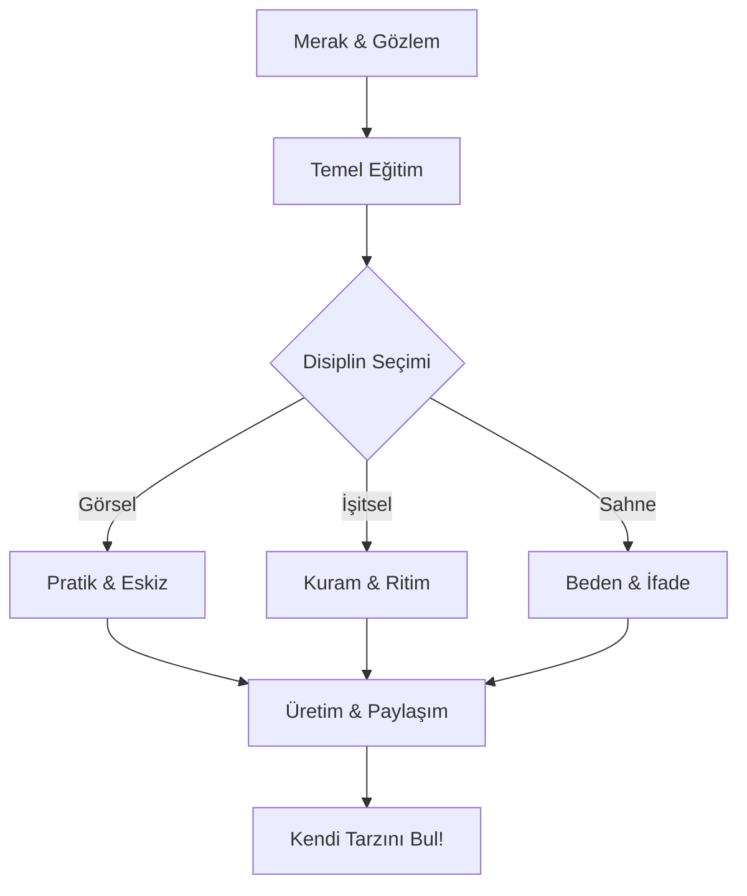

# 🎨 Sanatın İzinde: Açık Kaynak Sanat Rehberi ve Kaynakçası

  

> *"Sanat, ebediyetin dilidir; kelimelerin bittiği yerde başlayan sessiz bir haykırıştır."*

Hoş geldiniz! Bu repo, sadece bir bilgi deposu değil, aynı zamanda sanatın insan ruhu ve toplum üzerindeki iyileştirici, dönüştürücü ve birleştirici gücünü keşfetmek isteyenler için bir **pusuladır**. 

---

## 📂 İçindekiler
1. [📊 Vizyon ve Misyon](#-vizyon-ve-misyon)
2. [🗺️ Sanat Serüveninizi Seçin!](#️-sanat-serüveninizi-seçin)
3. [🖼️ Sanal Galeri: Başyapıtlar](#️-sanal-galeri-başyapıtlar)
4. [🎭 Sanatın Temel Disiplinleri](#-sanatın-temel-disiplinleri)
5. [🗺️ Gelişim İçin Yol Haritası](#-gelişim-için-yol-haritası)
6. [🧠 Sanat Felsefesi ve Estetik](#-sanat-felsefesi-ve-estetik)
7. [🚀 Sanatın Geleceği ve Dijital Dönüşüm](#-sanatın-geleceği-ve-dijital-dönüşüm)
8. [📚 Önerilen Kaynaklar](#-önerilen-kaynaklar)
9. [🤝 Nasıl Katkıda Bulunabilirsiniz?](#-nasıl-katkıda-bulunabilirsiniz)

---

## 📊 Vizyon ve Misyon

### Vizyonumuz
Dünya üzerindeki her bireyin, sanatın dallarından en az biriyle barışık olduğu, estetik kaygının günlük yaşamın bir parçası haline geldiği ve yaratıcılığın önündeki bariyerlerin kalktığı bir gelecek hayal ediyoruz.

---

## 🧭 Sanat Serüveninizi Seçin!

Nereden başlayacağınızı bilmiyorsanız, size özel hazırladığımız **[Sanat Serüveni](seruven.md)** sayfamızda kendi rotanızı belirleyebilirsiniz.

---

## 🖼️ Sanal Galeri: Başyapıtlar

Dünyayı değiştiren, bakış açımızı dönüştüren 10 büyük eserin hikayesini ve sanatsal analizini [**Sanal Galeri: Başyapıtlar**](galeri/bas-yapitalar.md) sayfamızda keşfedin.

---

## 🎭 Sanatın Temel Disiplinleri

Sanatın sonsuz evreninde yolculuğa çıkmak için kapılarımız:

*   🖼️ [**Görsel Sanatlar**](disiplinler/01-gorsel-sanatlar.md): Çizginin, rengin ve formun sessiz ama etkili dili.
*   🎵 [**İşitsel Sanatlar**](disiplinler/02-isitsel-sanatlar.md): Zamanın ritmik dökümü, ruhun matematiksel ifadesi.
*   🎭 [**Sahne Sanatları**](disiplinler/03-sahne-sanatlari.md): İnsanlık hallerinin şimdiki zamanda kanlı canlı temsili.
*   📚 [**Edebi Sanatlar**](disiplinler/04-edebi-sanatlar.md): Kelimelerle evrenler inşa etme sanatı.

---

## 🗺️ Gelişim İçin Yol Haritası

Sanata başlamak bir varış noktası değil, bir **keşif yolculuğudur**. İşte sizin için çizdiğimiz interaktif yol haritası:

Ayrıntılı rehber için [**Sanata Başlangıç Rehberi**](rehberler/sanata-baslangic.md) sayfamızı ziyaret edin.

---

## 🧠 Sanat Felsefesi ve Estetik

"Güzel" nedir? "Çirkin" sanatsal olabilir mi? Bu soruların cevabı yoksa da, arayışın kendisi [**Estetik ve Felsefe**](rehberler/estetik-ve-felsefe.md) sayfamızda gizli.

---

## 🚀 Sanatın Geleceği ve Dijital Dönüşüm

21. yüzyıl, sanatın tanımını yeniden yapıyor.
*   **Yapay Zeka (AI) ve Sanat:** Algoritmalar yaratıcı olabilir mi?
*   **NFT ve Blokzincir:** Dijital sanatın sahipliği.
*   **VR/AR Deneyimleri:** Sanatın içine girmek.

---

## 📚 Önerilen Kaynaklar

*   📖 [**Kitap Önerileri**](kaynaklar/kitaplar.md): Sanat tarihinin mihenk taşları.
*   🌐 [**Dijital Platformlar**](kaynaklar/online-platformlar.md): Online sergiler ve eğitimler.
*   🏛️ [**Müzeler ve Galeriler**](kaynaklar/muzeler.md): Görülmesi gereken dünya mirasları.
*   🖋️ [**Özlü Sözler ve Bilgelik**](kaynaklar/ozlu-sozler.md): Ustaların ruhundan dökülenler.
*   📖 [**A'dan Z'ye Sanat Sözlüğü**](kaynaklar/sozluk.md): Temel kavramlar rehberi.

---

## 🌍 Neden Sanat?
Sanat, bir süsleme aracı değil, bir **varoluş mücadelesidir**.
*   **Antropolojik Hafıza:** İnsanlık tarihini sanattan okuruz.
*   **Bilişsel Esneklik:** Beyindeki yeni köprüler.
*   **Toplumsal Empati:** Evrensel "biz"i inşa etme gücü.

---

## 🤝 Nasıl Katkıda Bulunabilirsiniz?

Bu bir topluluk projesidir. Siz de bir taş koymak isterseniz Lütfen [**KATKI REHBERİ**](CONTRIBUTING.md) dosyasını inceleyin.

---

**Lisans:** Bu proje [MIT Lisansı](LICENSE) kapsamında korunmaktadır.