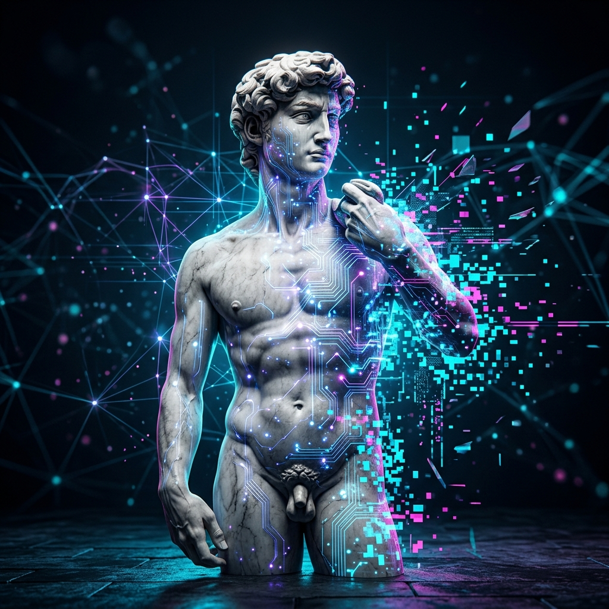

 
# 🚀 Dijital Sanatlar ve Geleceğin Estetiği

Dijital dönüşüm, sanatın sadece araçlarını değil, temel tanımını da değiştiriyor. Pikselden koda, VR'dan AI'ya sanatın yeni sınırlarını keşfedin.

---

## 1. Üretken Sanat (Generative Art)
Kodun ve algoritmaların sanatçı haline geldiği bir alan. Sanatçı, sonucu doğrudan çizmek yerine, sonucu doğuracak sistemi (kod) tasarlar.
- **Özellik:** Beklenmediklik, karmaşıklık ve sonsuz varyasyon.

## 2. Yapay Zeka ve Sanat (AI Art)
Yapay zekanın (Midjourney, Stable Diffusion, DALL-E) insan yaratıcılığıyla işbirliği yaptığı disiplin.
- **Tartışma:** "Yaratıcı kim: Algoritma mı, yoksa komutu (prompt) yazan insan mı?"

## 3. NFT ve Kripto Sanat
Blokzincir teknolojisiyle dijital eserlerin mülkiyetinin ve nadirliğinin kanıtlandığı yeni bir ekonomi. Sanatın demokratikleşmesi ve dijital varlıkların değer kazanması.

## 4. VR ve AR Deneyimleri
İzleyicinin eserin "içinde" olduğu, üç boyutlu ve etkileşimli sanat mekanları. Fiziksel sınırların kalktığı, tamamen hayal gücüyle inşa edilen galeriler.

---

### 🎨 Dijital Sanata Başlamak İçin
1.  **Kodlama Öğrenin**: Processing (p5.js) veya Python ile görsel programlamaya giriş yapın.
2.  **AI Araçlarını Deneyin**: Prompt engineering tekniklerini geliştirerek hayal gücünüzü dijitalleştirin.
3.  **Blokzinciri Anlayın**: Dijital sanatın gelecekteki mülkiyet modellerini kavrayın.

---
> [!IMPORTANT]
> Dijital araçlar ne kadar gelişirse gelişsin, sanatın özündeki "duygu" ve "hikmet" arayışı her zaman insanın elinde kalacaktır.

[🏠 Ana Sayfaya Dön](../README.md)
