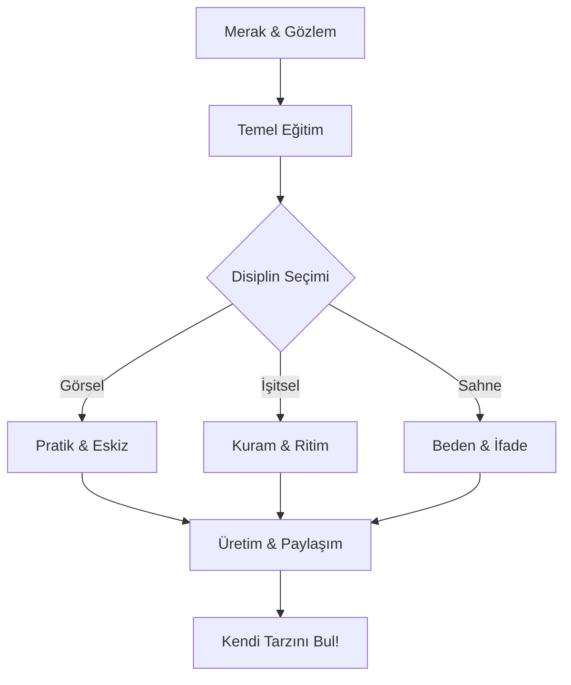

# Sanata Balang Rehberi

Sanata balamak iin "zel bir yetenek" veya "sekinci bir eitim" art deildir. Sanat bir kas gibidir; ilgi, dzenli pratik ve doru bak asyla gelitirilebilir.

## Yol Haritası (İnteraktif)

---

## 3. "Kötü" Üretme Özgürlüğü
En büyük engel, ilk denemede mükemmel olma isteğidir.
*   **Taslak Defteri:** Yannzda her zaman bir taslak defteri (sketchbook) talyn. Gördüklerinizi, duyduklarnızı veya aklınıza gelenleri anlık kaydedin.
*   **Kantite over Kalite:** Balangta nemli olan ne kadar "iyi" yaptnz deil, ne kadar "ok" yaptnzdr.

## 4. Kopyalamak Bir Eğitimdir
Eski ustalar, kendi tarzlarn bulmadan nce ustalar kopyalayarak tekniklerini gelitirdiler.
*   Mona Lisa'yı yeniden izmeye alışın, sevdiiniz bir iiri taklit edin veya bir mzik parasını kulaktan çıkarmaya alışın.

## 5. Paylaşın ve Geri Bildirim Alın
Sanat bir iletişim aracıdr.
*   Eserlerinizi gvendiiniz kiilerle veya çevrimiçi platformlarda paylan.
*   Eleştirileri kiisel saldırı olarak değil, gelişim frsatı olarak görün.

---
[?? Ana Sayfaya Dn](../README.md)
